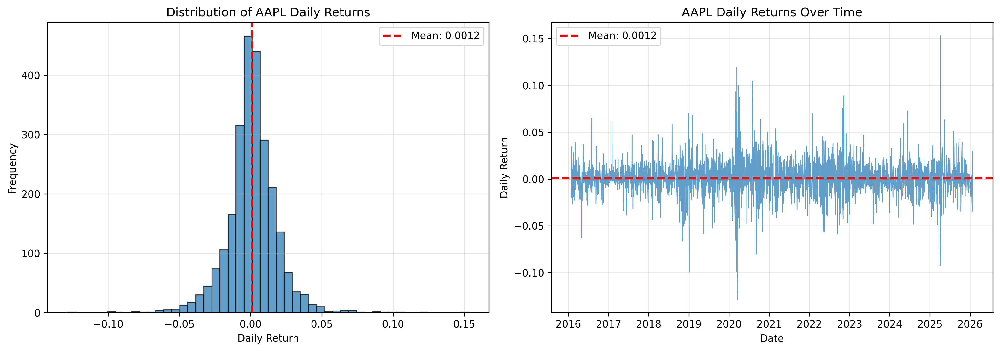
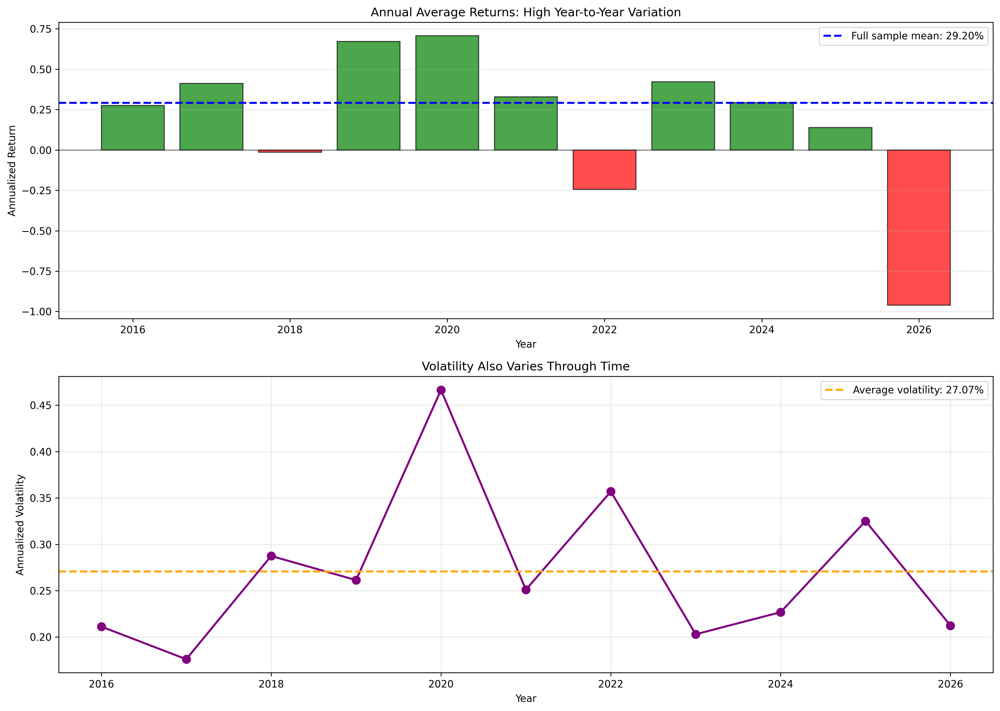

# Getting Started

In this chapter, we introduce the implied cost of capital (ICC): a forward-looking expected return estimate obtained by solving a valuation model for the discount rate. The goal is to understand why ICC exists, how it differs from historical-return approaches, and what families of ICC methods the literature uses.

```{note}
We use *expected return* and *cost of equity* interchangeably when the context is equity valuation.
```

## What are expected returns?

Expected returns represent the compensation investors demand for bearing risk and for the time value of money. Expected returns are central to almost every major financial decision:

- **Valuation:** They serve as the discount rate to convert expected future cash flows into present value.
- **Capital budgeting:** Firms use them as hurdle rates to evaluate whether projects create shareholder value.
- **Portfolio optimization:** Investors use them to construct efficient portfolios that maximize return for a given level of risk ([Markowitz, 1952](https://onlinelibrary.wiley.com/doi/10.1111/j.1540-6261.1952.tb01525.x)).

Gross returns are defined as: 

$$R_{t+1} = \frac{P_{t+1} + D_{t+1} - P_t}{P_t}$$

where $P_t$ is the price at time $t$, $P_{t+1}$ is the price at time $t+1$, and $D_{t+1}$ is the dividend paid between $t$ and $t+1$. The expected return is the conditional expectation of future returns given information available at time $t$:

$$E_t[R_{t+1}] = \frac{E_t[P_{t+1} + D_{t+1}] - P_t}{P_t}$$

The cost of equity is the expected return required by investors to hold a firm's equity. It reflects compensation for time value of money and risk. This is the discount rate used to value future cash flows from equity:

$$P_t = E_t\left[\sum_{s=1}^{\infty} \frac{X_{t+s}}{(1 + r_e)^s}\right]$$

where $X_{t+s}$ are the expected future cash flows to equity (e.g., dividends, earnings, residual income) and $r_e$ is the cost of equity (or expected return).

Yet **expected returns are not observable**, so every empirical approach must pick a proxy. In the following sections, we discuss two common backward-looking approaches based on historical returns, then introduce ICC as a forward-looking alternative.

## Two common backward-looking approaches

There is no shortage of models that explain expected returns ([Cochrane, 2011](https://onlinelibrary.wiley.com/doi/abs/10.1111/j.1540-6261.2011.01671.x)): macroeconomic models, behavioral theories, and factor models. But in practice, most applied work still relies on historical returns—either directly (sample averages) or indirectly (factor models estimated from past data).

Historical approaches share a critical assumption: the future will look like the past. They treat realized returns as the best guide to future returns. This works well in stable environments, but can be problematic when:
- risk premia vary over time ([Pastor and Stambaugh, 2001](https://www.jstor.org/stable/2697794)),
- firm characteristics change (growth firms mature, distressed firms recover),
- market conditions shift (financial crises, regulatory changes).


### Historical mean returns

A natural proxy is the sample mean of realized returns: 

$$\hat{E}[R] = \frac{1}{N} \sum_{t=1}^{N} R_t$$

It was long a standard recommendation in practice ([Harris and Marston, 1992](https://www.jstor.org/stable/3665665)). The implicit assumption is that the average past return is the best forecast of future returns. But this estimate can be dominated by noise, requiring long windows to become stable ([Elton, 1999](https://onlinelibrary.wiley.com/doi/abs/10.1111/0022-1082.00144)).

To illustrate the practical challenges of using historical mean returns, let's analyze Apple Inc. (AAPL) stock over the past 10 years. 

We start by downloading historical prices and computing daily returns:

```python
import polars as pl 
import yfinance as yf
import matplotlib.pyplot as plt
import numpy as np

# Download AAPL price data
ticker = yf.Ticker("AAPL")
prices = ticker.history(period="10y")  # Last 10 years of data

# Convert to Polars DataFrame
df = pl.DataFrame({
    'date': prices.index,
    'price': prices['Close'].values
})

# Compute returns
df = df.with_columns([
    (pl.col('price') / pl.col('price').shift(1) - 1).alias('return')
])

# Remove first row (NaN return)
df = df.filter(pl.col('return').is_not_null())

# Print summary statistics
print(f"Mean return: {df['return'].mean():.4f}")
print(f"Std dev: {df['return'].std():.4f}")
print(f"Min return: {df['return'].min():.4f}")
print(f"Max return: {df['return'].max():.4f}")
```

The distribution of daily returns shows high variability. While we can compute a sample mean, individual returns vary widely around it:

```python
# Plot distribution of returns
fig, axes = plt.subplots(1, 2, figsize=(14, 5))

# Histogram
axes[0].hist(df['return'].to_numpy(), bins=50, edgecolor='black', alpha=0.7)
axes[0].axvline(df['return'].mean(), color='red', linestyle='--', 
                linewidth=2, label=f'Mean: {df["return"].mean():.4f}')
axes[0].set_xlabel('Daily Return')
axes[0].set_ylabel('Frequency')
axes[0].set_title('Distribution of AAPL Daily Returns')
axes[0].legend()
axes[0].grid(True, alpha=0.3)

# Time series of returns
axes[1].plot(df['date'].to_numpy(), df['return'].to_numpy(), 
             linewidth=0.8, alpha=0.7)
axes[1].axhline(0, color='black', linestyle='-', linewidth=0.5)
axes[1].axhline(df['return'].mean(), color='red', linestyle='--', 
                linewidth=2, label=f'Mean: {df["return"].mean():.4f}')
axes[1].set_xlabel('Date')
axes[1].set_ylabel('Daily Return')
axes[1].set_title('AAPL Daily Returns Over Time')
axes[1].legend()
axes[1].grid(True, alpha=0.3)

plt.tight_layout()
plt.show()
```




The estimated expected return depends heavily on which time window we choose. Rolling mean estimates show dramatic time variation:

```python
# Compute rolling mean returns with different window sizes
window_sizes = [60, 126, 252, 504]  # ~3 months, 6 months, 1 year, 2 years

df_rolling = df.select(['date', 'return'])

for window in window_sizes:
    df_rolling = df_rolling.with_columns([
        pl.col('return').rolling_mean(window_size=window).alias(f'mean_{window}d')
    ])

# Annualize the rolling means (assuming 252 trading days per year)
for window in window_sizes:
    df_rolling = df_rolling.with_columns([
        (pl.col(f'mean_{window}d') * 252).alias(f'annual_{window}d')
    ])
```

Now, let's visualize how rolling mean estimates vary over time and across window sizes:

```python
# Plot rolling mean estimates
fig, axes = plt.subplots(2, 1, figsize=(14, 10))

# Panel 1: Rolling mean estimates over time
for window in window_sizes:
    label = f'{window} days (~{window//252} yr)' if window >= 252 else f'{window} days'
    axes[0].plot(df_rolling['date'].to_numpy(), 
                df_rolling[f'annual_{window}d'].to_numpy(),
                label=label, alpha=0.7, linewidth=1.5)

axes[0].axhline(df['return'].mean() * 252, color='black', linestyle='--', 
               linewidth=2, label='Full sample mean')
axes[0].set_xlabel('Date')
axes[0].set_ylabel('Annualized Expected Return')
axes[0].set_title('Rolling Mean Return Estimates: High Time Variation')
axes[0].legend(loc='best')
axes[0].grid(True, alpha=0.3)

# Panel 2: Distribution of rolling mean estimates
data_for_box = []
labels_for_box = []

for window in window_sizes:
    valid_estimates = df_rolling[f'annual_{window}d'].drop_nulls().to_numpy()
    data_for_box.append(valid_estimates)
    labels_for_box.append(f'{window}d')

bp = axes[1].boxplot(data_for_box, labels=labels_for_box, patch_artist=True)
for patch in bp['boxes']:
    patch.set_facecolor('lightblue')
    patch.set_alpha(0.7)

axes[1].axhline(df['return'].mean() * 252, color='red', linestyle='--', 
               linewidth=2, label='Full sample mean')
axes[1].set_xlabel('Rolling Window Size')
axes[1].set_ylabel('Annualized Expected Return')
axes[1].set_title('Distribution of Rolling Mean Estimates: Wide Dispersion')
axes[1].legend()
axes[1].grid(True, alpha=0.3, axis='y')

plt.tight_layout()
plt.savefig('figures/module1/aapl_rolling_mean_estimates.png', dpi=300, bbox_inches='tight')
plt.show()
```


Rolling mean estimates fluctuate dramatically. Shorter windows (60 days) produce more volatile estimates, while longer windows (504 days) are smoother but still show substantial variation.

If we need to estimate expected returns for a valuation on a specific date, which window should we choose? The answer is unclear, and different choices lead to vastly different discount rates.

Annual returns show dramatic year-to-year swings, suggesting that risk premia vary over time:

```python
# Extract year from date and compute annual averages
df_annual = df.with_columns([
    pl.col('date').dt.year().alias('year')
])

annual_stats = df_annual.group_by('year').agg([
    pl.col('return').mean().alias('mean_return'),
    pl.col('return').std().alias('std_return'),
    pl.col('return').count().alias('n_obs')
]).sort('year')

# Annualize the returns
annual_stats = annual_stats.with_columns([
    (pl.col('mean_return') * 252).alias('annual_return'),
    (pl.col('std_return') * np.sqrt(252)).alias('annual_volatility')
])

# Plot annual returns
fig, axes = plt.subplots(2, 1, figsize=(14, 10))

# Panel 1: Bar chart of annual returns
years = annual_stats['year'].to_numpy()
returns = annual_stats['annual_return'].to_numpy()
colors = ['green' if r > 0 else 'red' for r in returns]

axes[0].bar(years, returns, color=colors, alpha=0.7, edgecolor='black')
axes[0].axhline(df['return'].mean() * 252, color='blue', linestyle='--', 
               linewidth=2, label=f'Full sample mean: {df["return"].mean()*252:.2%}')
axes[0].axhline(0, color='black', linestyle='-', linewidth=0.5)
axes[0].set_xlabel('Year')
axes[0].set_ylabel('Annualized Return')
axes[0].set_title('Annual Average Returns: High Year-to-Year Variation')
axes[0].legend()
axes[0].grid(True, alpha=0.3, axis='y')

# Panel 2: Volatility over time
volatility = annual_stats['annual_volatility'].to_numpy()

axes[1].plot(years, volatility, marker='o', linewidth=2, markersize=8, color='purple')
axes[1].axhline(volatility.mean(), color='orange', linestyle='--', 
               linewidth=2, label=f'Average volatility: {volatility.mean():.2%}')
axes[1].set_xlabel('Year')
axes[1].set_ylabel('Annualized Volatility')
axes[1].set_title('Volatility Also Varies Through Time')
axes[1].legend()
axes[1].grid(True, alpha=0.3)

plt.tight_layout()
plt.savefig('figures/module1/aapl_annual_returns_volatility.png', dpi=300, bbox_inches='tight')
plt.show()
```



The top panel shows that some years have returns above 50% while others are negative. The full-sample mean (blue dashed line) is not particularly representative of any individual year. The bottom panel shows that volatility also varies substantially through time, further complicating the estimation problem.

This tutorial demonstrates three fundamental problems with using historical mean returns as a proxy for expected returns:

1. **Estimation instability**: Different time windows produce dramatically different estimates. There's no clear criterion for choosing the "right" window.

2. **Wide confidence intervals**: Even with 10 years of daily data (2500+ observations), standard errors remain large. For individual stocks, 95% confidence intervals easily span 20-30 percentage points.

3. **Time-varying risk premia**: If expected returns change over time (as suggested by the rolling mean patterns and year-to-year variation), then using a long-run average is incorrect—it's an average of many different expected returns, not an estimate of the current one.


### Factor models

Factor models impose structure: expected returns are tied to exposures to a small set of systematic risks. The CAPM is the canonical example (Sharpe, 1964; Lintner, 1965; Mossin, 1966): 

$$E[R_i] = R_f + \beta_i (R_m - R_f)$$

where $\beta_i = \frac{Cov(R_i, R_m)}{Var(R_m)}$, $R_f$ is the risk-free rate, and $R_m$ is the market return. The CAPM says that a stock's expected return depends only on its market beta.

Factor models can reduce some measurement error relative to individual mean returns, but they remain backward-looking: betas and factor premia are estimated from historical data, implicitly assuming that past covariances and risk premia will persist. Results are sensitive to estimation windows and to whether the factor structure itself is stable over time. Despite these issues, the CAPM remains a widely taught benchmark (e.g., Berk and DeMarzo, 2013).

```python 
# 1) estimate beta via regression
# 2) plug beta into CAPM expected return formula
```

Empirical asset pricing introduced additional factors—size (Banz, 1981), value (Fama and French, 1992), momentum (Jegadeesh and Titman, 1993), investment (Titman et al., 2004), profitability (Novy-Marx, 2013):

$$E[R_i] = R_f + \beta_{i,m}(E[R_m] - R_f) + \beta_{i,SMB}E[SMB] + \beta_{i,HML}E[HML] + ... $$

These models are powerful in many applications, yet expected return estimates can remain noisy even in multi-factor settings (Fama and French, 1997). Moreover, they still rely on the assumption that historical factor exposures and premia are informative about the future.

```python 
# 1) load factor returns
# 2) estimate betas
# 3) compute expected returns using factor premia
```

## A Forward-looking alternative: Implied Cost of Capital (ICC)

Historical-return approaches estimate expected returns from the time series of realized returns, implicitly assuming that the past is a good guide to the future. ICC flips the direction. Instead of looking backward, ICC looks forward: we infer the discount rate that makes today's price consistent with current expectations of future payoffs (typically from analyst forecasts or forecast models).

This is the "reverse valuation" idea that underlies ICC methods such as Gebhardt et al. (2001), Claus and Thomas (2001), Easton (2004), and Ohlson and Juettner-Nauroth (2005).

A useful way to understand ICC is through the "discount-rate variation" view of stock prices. Shiller (1981) argues that prices fluctuate too much to be justified by dividend changes alone, which implies that discount rates must vary over time. This view fits naturally with the return predictability literature and with approaches that try to infer discount rates from current prices rather than from past returns.

ICC methods start from a valuation identity with price on the left-hand side and discounted expected payoffs on the right-hand side, then solve for $r$:

$$P_t = E_t\left[\sum_{s=1}^{\infty} \frac{X_{t+s}}{(1 + r)^s}\right]$$

where $X_t$ could be dividends, earnings, residual income, or abnormal earnings growth, depending on the model. The unknown $r$ is the implied cost of equity. ICC methods differ in the choice of (i) the payoff definition $X_t$ and (ii) the terminal value / long-run assumptions.

Dividend Discount Models (DDM) use dividends as payoffs, while Clean Surplus Accounting models use earnings and book values to restate the valuation identity. We discuss both families below.

### Dividend Discount models (DDM)
DDM methods forecast dividends (or payout ratios) and impose assumptions about long-run growth.

$$P_t = \sum_{t=1}^{n} \frac{D_t}{(1+r)^t} + \frac{P_n}{(1+r)^n}$$

with terminal value $P_n$ often computed using the Gordon Growth Model:

$$P_n = \frac{D_{n+1}}{r - g}$$

where $g$ is the long-run growth rate.

- Malkiel (1979) uses the classic constant-growth logic and highlights sensitivity to the long-run growth assumption; Malkiel (1970) proposes mean reversion of growth toward GDP growth.
- Harris (1986) links ICC to dividend yield plus long-term growth forecasts (using IBES forecasts).
- Gordon and Gordon (1997) assume a finite growth horizon.
- Botosan and Plumlee (2002) incorporate multi-year dividend forecasts and a target price.
- Pastor et al. (2008) use explicit short-run forecasts, mean-revert growth toward macro anchors, and set a terminal structure consistent with “value-irrelevant” growth beyond a horizon.

```python
Figure placeholders

DDM timeline / cash flow forecast diagram

Sensitivity plot: long-run growth vs ICC
```

### Clean surplus accounting and earnings-based models

When dividends are irregular or absent (common in modern equity markets), clean surplus accounting provides an alternative. 

```python
# show big part of firms pay no dividends
```

The key insight is that we can restate the dividend discount model in terms of earnings and book values using the **clean surplus relation** (Ohlson, 1995):

$$B_{t} = B_{t-1} + E_{t} - D_{t}$$

where $B_t$ is the book value of equity at time $t$, $E_t$ are earnings, and $D_t$ are dividends. This identity states that changes in book value equal earnings minus dividends (assuming no capital transactions or "dirty surplus" items).

#### From dividends to residual income

Starting from the dividend discount model:

$$P_t = \sum_{s=1}^{\infty} \frac{E_t[D_{t+s}]}{(1+r)^s}$$

We can substitute the clean surplus relation $D_{t+s} = E_{t+s} - (B_{t+s} - B_{t+s-1})$ into the DDM and rearrange terms. After telescoping the book value terms, we obtain the **Residual Income Model (RIM)**:

$$P_t = B_t + \sum_{s=1}^{\infty} \frac{E_t[E_{t+s} - r \cdot B_{t+s-1}]}{(1+r)^s}$$

The term $RI_{t+s} = E_{t+s} - r \cdot B_{t+s-1}$ is called **residual income** (or economic profit): it represents earnings in excess of the capital charge. The RIM says that value equals book value plus the present value of expected future residual income.

RIM is often more stable than DDM because:
- It anchors on book value (which is observable and relatively stable),
- Residual income tends to mean-revert toward zero faster than dividends or earnings levels,
- It works for firms that pay irregular or zero dividends.

#### From residual income to abnormal earnings growth

The **Abnormal Earnings Growth (AEG)** model is an alternative transformation that anchors on capitalized earnings rather than book value. Starting from the RIM, we can show (through algebraic manipulation involving the clean surplus relation) that:

$$P_t = \frac{E_{t+1}}{r} + \sum_{s=1}^{\infty} \frac{E_t[AEG_{t+s}]}{(1+r)^s}$$

where abnormal earnings growth is defined as:

$$AEG_{t+s} = E_{t+s} - E_{t+s-1} - r \cdot (E_{t+s-1} - D_{t+s-1})$$

or equivalently:

$$AEG_{t+s} = E_{t+s} - (1+r) \cdot E_{t+s-1} + r \cdot D_{t+s-1}$$

The AEG model says that value equals capitalized next-period earnings plus the present value of abnormal earnings growth.

AEG can be easier to implement when:
- Short-term earnings forecasts are more reliable than book value or ROE forecasts,
- We want to avoid explicit book value tracking (useful for daily estimation),
- Terminal value assumptions are naturally stated in terms of earnings growth stabilization.

#### Practical implementations

This motivates models that are often easier to operationalize with accounting data:
- **Residual Income Model (RIM):** Gebhardt et al. (2001) forecast ROE explicitly for a few years, then transition ROE toward an industry benchmark. Claus and Thomas (2001) use market-level ICC with explicit forecast structure and a long-run residual income growth assumption tied to inflation.
- **Abnormal Earnings Growth (AEG):** Easton (2004) assumes no growth in abnormal earnings beyond the short-term forecast horizon. Ohlson and Juettner-Nauroth (2005) allow for short-term and long-term growth rates that differ, with the long-term rate anchored to risk-free rate minus a premium.


### Testing ICC implementations

ICC estimates are generally evaluated based on their association with realized returns. A good ICC measure should be positively correlated with future realized returns, since higher expected returns should lead to higher realized returns on average. However, this relationship is inherently noisy because:
- realized returns contain both expected and unexpected components,
- the unexpected component (return shocks) can dominate over short horizons,
- even if ICC is correct on average, individual firms experience idiosyncratic shocks.

The most common validation approach is the **portfolio sort test**. The logic is straightforward: if ICC correctly measures expected returns, then stocks with higher ICC should earn higher realized returns on average.

**Step-by-step procedure:**
1. **At each time period $t$ (e.g., monthly):** Compute ICC for all available stocks using current prices and forecasts.
2. **Sort stocks into portfolios:** Rank stocks by their ICC estimate and form portfolios (typically 5 quintiles or 10 deciles). Portfolio 1 contains stocks with the lowest ICC, Portfolio 5 (or 10) contains stocks with the highest ICC.
3. **Hold and measure returns:** Hold each portfolio for a fixed horizon (e.g., 1 month, 1 quarter, or 1 year) and compute the realized return:
   - Equal-weighted: $R_{p,t+1} = \frac{1}{N_p} \sum_{i \in p} R_{i,t+1}$
   - Value-weighted: $R_{p,t+1} = \sum_{i \in p} w_{i,t} R_{i,t+1}$ where $w_{i,t} = \frac{ME_{i,t}}{\sum_{j \in p} ME_{j,t}}$
4. **Rebalance:** At time $t+1$, re-sort all stocks based on updated ICC estimates and reform portfolios.
5. **Test for monotonicity:** Examine whether average realized returns increase monotonically across portfolios:
   $$\bar{R}_1 < \bar{R}_2 < ... < \bar{R}_5$$
   
   The key test is whether the high-minus-low (HML) portfolio earns a positive return:
   $$\bar{R}_{5} - \bar{R}_{1} > 0$$
   
   with statistical significance assessed using a t-statistic.

**Key findings from the literature:**
- **Gebhardt et al. (2001):** Find monotonic relation between ICC quintiles and 1-year-ahead realized returns. The high-minus-low portfolio earns approximately 7-8% per year.

- **Claus and Thomas (2001):** Show that market-level ICC (value-weighted average across all stocks) predicts aggregate market returns at annual horizons.

- **Lee et al. (2009):** Compare multiple ICC measures and find that most exhibit positive association with future returns, though the strength varies. Some measures show stronger monotonicity than others.

**Practical considerations:**
- **Holding period:** Longer horizons (1 year) typically show clearer patterns than shorter horizons (1 month) because noise averages out. However, longer horizons mean fewer independent observations.

- **Weighting scheme:** Equal-weighting gives more influence to small stocks; value-weighting reflects the investable market but can be dominated by large firms.

- **Data requirements:** The test requires sufficient firms in each portfolio at each time period. Studies typically restrict to firms with non-missing ICC, which can induce survivorship bias.

- **Transaction costs:** Frequent rebalancing (monthly) can erode returns in practice. Annual rebalancing is more realistic but reduces the number of observations.

```python
# Pseudo-code for portfolio sort test

# Step 1: Estimate ICC for all stocks at month t
icc_df = compute_icc(prices, forecasts, book_values, date=t)

# Step 2: Sort stocks into quintiles based on ICC
icc_df['quintile'] = pd.qcut(icc_df['icc'], q=5, labels=[1, 2, 3, 4, 5])

# Step 3: Form portfolios and compute returns
for quintile in [1, 2, 3, 4, 5]:
    portfolio_stocks = icc_df[icc_df['quintile'] == quintile]
    
    # Equal-weighted return
    ew_return = portfolio_stocks['return_t+1'].mean()
    
    # Value-weighted return
    portfolio_stocks['weight'] = portfolio_stocks['market_cap'] / portfolio_stocks['market_cap'].sum()
    vw_return = (portfolio_stocks['return_t+1'] * portfolio_stocks['weight']).sum()

# Step 4: Repeat for all time periods t = 1, 2, ..., T

# Step 5: Test for monotonicity
# Compute time-series average returns for each portfolio
# Test whether R_5 - R_1 > 0 using t-test
```

**Interpretation challenges:**
- **Ex-ante vs ex-post:** ICC is an ex-ante expected return measure, but we test it using ex-post realized returns. The two can diverge if:
  - unexpected news arrives (earnings surprises, macroeconomic shocks),
  - risk premia change over time,
  - ICC contains measurement error.

- **Power of the test:** Standard errors of portfolio returns are large, so tests have limited power to detect modest differences in expected returns. Typical annual return differences of 5-10% may not be statistically significant over 20-30 years of data.

- **Alternative explanations:** A positive ICC-return relation could reflect:
  - correct measurement of time-varying expected returns (the intended interpretation),
  - omitted risk factors that ICC happens to correlate with,
  - mispricing that ICC-based strategies exploit.

### Refinements and extensions in the literature

#### The long-run growth problem

Almost all ICC implementations must confront a key modeling choice: what happens in the long run. Long-run growth assumptions can have large effects on ICC estimates (Easton, 2007).

A major line of work tries to reduce reliance on an exogenous long-run growth assumption:
- Easton et al. (2002): estimate ICC and long-run growth jointly at the portfolio level via an iterative regression approach.
- Ashton and Wang (2013): regression-based approach grounded in linear information dynamics.
- Nekrasov and Ogneva (2011): extend joint estimation logic toward firm-level ICC via a multi-step procedure.

```python
Figure placeholder

Iteration schematic: guess r → compute LHS → regress → update r
```

#### From annual to daily ICC 

Many early ICC studies produce annual estimates and sometimes restrict to December fiscal year ends. Daske et al. (2006) show how to adapt methods for daily ICC estimation by constructing a “virtual” book value at time $t$ and aligning forecasted earnings with the fraction of the fiscal year remaining.

```python
Figure placeholder

Calendar alignment: fiscal year end vs estimation date
```

#### Forecast errors and analyst bias

ICC depends on forecasts. A second set of refinements focuses on the quality of earnings forecasts:
- Easton and Sommers (2007): analysts are optimistic in the U.S., biasing ICC upward; propose aggregation choices (e.g., value-weighting) to reduce bias effects in market measures.
- Guay et al. (2011): analysts react sluggishly to price information, generating predictable measurement error; propose portfolio-based adjustments.
- Larocque (2013) and Mohanram and Gode (2013): model forecast errors using observable firm characteristics; results differ on whether corrections improve association with realized returns.

```python
Figure placeholder

Forecast error adjustment pipeline
```

#### Replacing analysts: model-based earnings forecasts

Rather than correcting analyst forecasts, some papers replace them:
- Hou et al. (2012): pooled cross-sectional earnings forecast models using accounting predictors.
- Allee (2011): time-series earnings forecasts.
- Li and Mohanram (2014): earnings persistence (EP) and residual income (RI) forecasting models that allow asymmetric persistence for losses vs profits.


## Summary table of ICC implementations

| Reference | Valuation Model | Period | Earnings forecasts data |Long-term growth assumption |
|------:|:-----:|:------|------:|------:|
| Malkiel (1979)     | DDM     | 1966-1977     | Value Line     | Value Line/GDP growth rate |
| Harris (1986)     | DDM     | 1982-1984     | IBES     | Long-term growth forecasts from IBES |
| Gordon and Gordon (1997)    | DDM     | 1985-1991     | IBES     | Long-term growth forecasts from IBES |
| Botosan and Plumlee (2002)    | DDM     | 1986-2000    | Value Line     | Use of target price from Value Line |
| Pastor et al. (2008)    | DDM     | 1981-2002    | IBES     | Growth after year 15 is value irrelevant |
| Claus and Thomas (2001)    | RIM     | 1985-1998    | IBES     | Risk-free rate minus three percent |
| Gebhardt et al. (2001)  | RIM     | 1979-1995    | IBES     | Median industry ROE |
| Easton (2004)  | AEG     | 1981-1999    | IBES     | No growth in abnormal earnings |
| Ohlson and Juettner-Nauroth (2005)  | AEG     | 1984-1998    | IBES     | Risk-free rate minus three percent |
| Easton et al. (2002)  | RIM     | 1981-1998    | IBES     | Estimated simultaneously with the ICC |
| Ashton and Wang (2013)  | RIM     | 1975-2006    | IBES     | Estimated simultaneously with the ICC |
| Nekrasov and Ogneva (2011)  | RIM     | 1980-2007    | IBES     | Estimated simultaneously with the ICC |
| Allee (2011)  | AEG     | 1981-2010    | Time-series model     | No growth in abnormal earnings |
| Hou et al. (2012)  | DDM, RIM, AEG     | 1968-2008    | Cross-sectional model     | According to the respective valuation model |
| Li and Mohanram (2014)  | RIM, AEG     | 1969-2012    | EP and RI model    | According to the respective valuation model |


## Key Takeaways

```{note}
Historical mean returns and factor models are easy baselines, but expected return estimates can be dominated by sampling error.
```


```{note}
ICC methods are forward-looking: they infer discount rates from prices and forecasts via a valuation identity.
```


