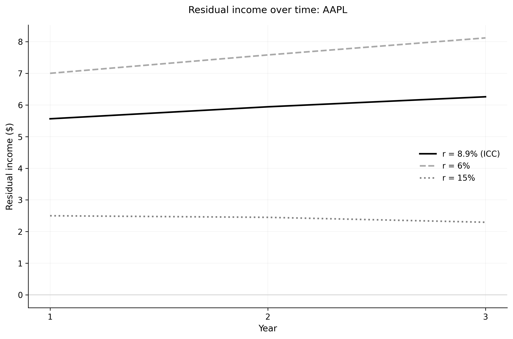
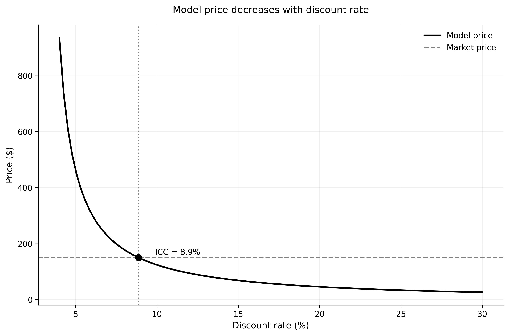
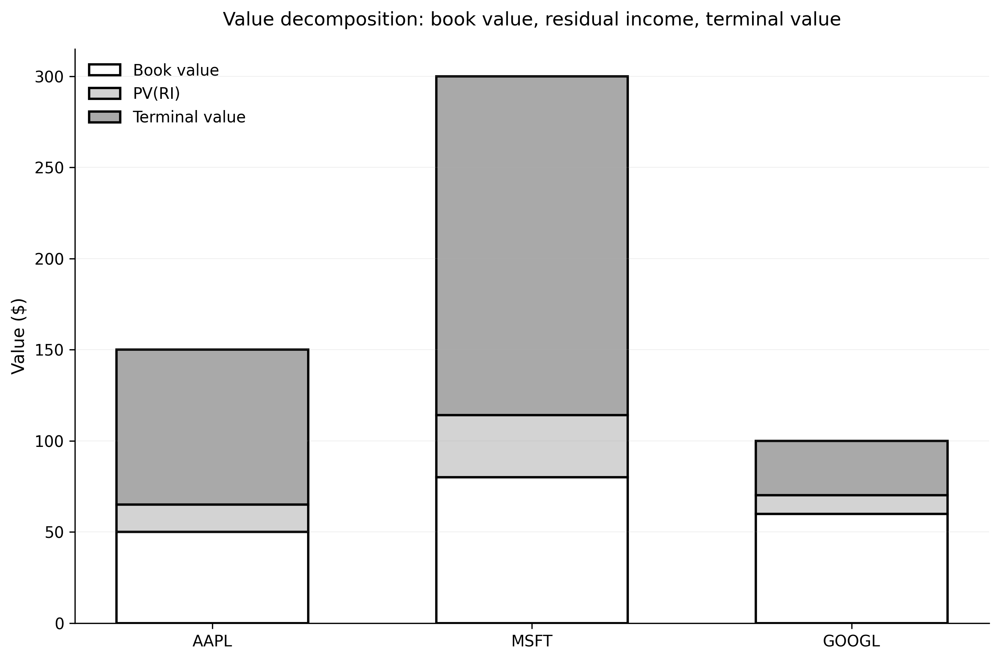

# Residual Income Model (RIM)

## Why Another Valuation Model?

You already know the dividend discount model: price equals the present value of dividends. So why do we need the residual income model?

Two reasons. First, many firms don't pay dividends, or pay erratic dividends that don't reflect value. Second—and this is the real reason—the RIM converges faster. You don't have to forecast cash flows out to infinity and hope your terminal value calculation isn't garbage. The RIM front-loads value into near-term forecasts.

That's worth understanding. Let's see how it works.

## Clean Surplus Accounting: The Foundation

The whole model rests on one accounting identity. It's called **clean surplus relation**, and it says:

$$
B_t = B_{t-1} + E_t - D_t
$$

where $B_t$ is book equity, $E_t$ is earnings, and $D_t$ is dividends.

What does this mean? Book value today equals book value yesterday, plus what you earned, minus what you paid out. Everything flows through the income statement—nothing bypasses it to go directly to equity. That's "clean surplus."

Is this true in practice? Mostly. There are some exceptions (comprehensive income, foreign currency adjustments), but for practical purposes, it's close enough. And it's theoretically exact if you interpret earnings the right way.

Now, why do we care? Because this identity lets us rewrite the dividend discount model in terms of earnings and book values instead of dividends. Watch.

**Starting position:**
- Book equity: $B_0 = \$50.00$
- Forecasted earnings: $E_1 = \$10.00$, $E_2 = \$11.00$, $E_3 = \$12.00$
- Payout ratio: 30% (firm pays out 30% of earnings as dividends)

**Year 1:**
- Start with book value: $B_0 = \$50.00$
- The firm earns: $E_1 = \$10.00$
- Dividends paid: $D_1 = 0.30 \times \$10.00 = \$3.00$
- Retained earnings: $\$10.00 - \$3.00 = \$7.00$
- Apply clean surplus: $B_1 = B_0 + E_1 - D_1 = \$50.00 + \$10.00 - \$3.00 = \$57.00$
- Book value grew by exactly the retained earnings. The $7 that wasn't paid out stays in the firm, increasing equity.

**Year 2:**
- Start with book value: $B_1 = \$57.00$
- The firm earns: $E_2 = \$11.00$
- Dividends paid: $D_2 = 0.30 \times \$11.00 = \$3.30$
- Retained earnings: $\$11.00 - \$3.30 = \$7.70$
- Apply clean surplus: $B_2 = B_1 + E_2 - D_2 = \$57.00 + \$11.00 - \$3.30 = \$64.70$

**Year 3:**
- Start with book value: $B_2 = \$64.70$
- The firm earns: $E_3 = \$12.00$
- Dividends paid: $D_3 = 0.30 \times \$12.00 = \$3.60$
- Retained earnings: $\$12.00 - \$3.60 = \$8.40$
- Apply clean surplus: $B_3 = B_2 + E_3 - D_3 = \$64.70 + \$12.00 - \$3.60 = \$73.10$

Book value grew by \$23.10 over three years (\$73.10 - \$50.00).

Where did that come from? 

From cumulative retained earnings: \$7.00 + \$7.70 + \$8.40 = \$23.10.

Every dollar retained adds exactly one dollar to book equity.

This is clean surplus. Earnings come in, dividends go out, and book value adjusts by the difference. No surprises, no mysterious equity changes. Everything flows through the income statement.

Now here's why this matters for valuation: if you know earnings and payout policy, you can project book values mechanically. And once you have book values, you can compute residual income. The whole model follows from this one accounting identity.

Book value grows with retained earnings. Nothing mysterious—just accounting.


### Implementing Clean Surplus

Before we go further, let's see what data we need. For each firm:
- Current price `P0`
- Current book equity `B0`
- Forecasted earnings: `E1`, `E2`, ..., `ET`
- Payout ratios or dividends
- Terminal growth rate `g`

In Python with Polars:

```python
import polars as pl

# Sample data structure
df = pl.DataFrame({
    'ticker': ['AAPL', 'MSFT', 'GOOGL'],
    'price': [150.0, 300.0, 100.0],
    'book_value': [50.0, 80.0, 60.0],
    'E1': [10.0, 20.0, 8.0],
    'E2': [11.0, 22.0, 9.0],
    'E3': [12.0, 24.0, 10.0],
    'payout_ratio': [0.25, 0.30, 0.0],  # dividend / earnings
})
```

To apply the RIM, we need to project book values forward using the clean surplus relation. Here's the implementation:

```python
def compute_future_book_values(
    B0: float,
    earnings: list[float],
    payout_ratio: float
) -> list[float]:
    """
    Compute future book values using clean surplus.
    
    B_t = B_{t-1} + E_t - D_t
    
    Parameters
    ----------
    B0 : float
        Current book value
    earnings : list[float]
        Forecasted earnings [E1, E2, ..., ET]
    payout_ratio : float
        Dividend payout ratio (dividends / earnings)
    
    Returns
    -------
    list[float]
        Book values [B0, B1, B2, ..., BT]
    """
    book_values = [B0]
    
    for E_t in earnings:
        D_t = E_t * payout_ratio
        B_t = book_values[-1] + E_t - D_t
        book_values.append(B_t)
    
    return book_values
```

Simple loop, clean logic. Now let's use this to derive the residual income formulation.


## From Dividends to Residual Income

Start with the dividend discount model:

$$
P_0 = \sum_{t=1}^{\infty} \frac{E[D_t]}{(1+r)^t}
$$

Now substitute the clean surplus relation. Solve for dividends: $D_t = E_t - (B_t - B_{t-1})$. Plug that in, do some algebra (I'll spare you the details), and you get:

$$
P_0 = B_0 + \sum_{t=1}^{\infty} \frac{E[RI_t]}{(1+r)^t}
$$

where **residual income** is defined as:

$$
RI_t = E_t - r \cdot B_{t-1}
$$

What's going on here? Residual income is earnings minus a charge for the book equity employed. It's the earnings left over after paying investors for their capital. If the firm earns exactly the cost of capital on book equity, residual income is zero and the stock is worth book value. If it earns more, residual income is positive and the stock trades at a premium to book.

This is just accounting manipulation—no new economics. But it changes everything about how we implement the model.

### Computing Residual Income in Code

Given book values, earnings, and a trial discount rate $r$, computing residual income is straightforward:

```python
def compute_residual_income(
    earnings: list[float],
    book_values: list[float],
    r: float
) -> list[float]:
    """
    Compute residual income for each forecast period.
    
    RI_t = E_t - r * B_{t-1}
    
    Parameters
    ----------
    earnings : list[float]
        Forecasted earnings [E1, E2, ..., ET]
    book_values : list[float]
        Book values [B0, B1, ..., BT]
    r : float
        Discount rate (trial value when solving for ICC)
    
    Returns
    -------
    list[float]
        Residual income for each period
    """
    RI = []
    
    for t, E_t in enumerate(earnings, start=1):
        B_prev = book_values[t - 1]
        RI_t = E_t - r * B_prev
        RI.append(RI_t)
    
    return RI
```

The charge `r * B_{t-1}` is the capital cost. Subtract it from earnings to get abnormal earnings.

Here's how residual income behaves under different discount rate assumptions:



At the ICC, residual income is calibrated just right to justify the market price. Higher discount rates mean larger capital charges, so residual income is lower. Lower discount rates mean smaller charges, so residual income is higher.


## Why This Is Useful

Here's the key insight: **residual income tends to zero faster than dividends**.

Why? Because residual income measures *abnormal* earnings—the difference between what the firm actually earns and what it should earn given its book equity. In competitive markets, abnormal profits get competed away. High ROE attracts entry. Low ROE triggers exit or restructuring. Over time, ROE reverts to the cost of capital, so residual income fades.

Dividends, by contrast, can grow forever if the firm is growing. You have to forecast them out decades and then slap on a terminal value. That terminal value often dominates the valuation—which means your valuation is really just a guess about the growth rate 20 years out.

With the RIM, near-term forecasts matter more. The terminal value is smaller. Your valuation is less sensitive to crazy assumptions about the distant future.

That's the practical advantage. Now let's see how to implement it.

## The Two-Stage RIM

In practice, we need to make the model finite. The standard approach—used by Claus and Thomas (2001) and many others—is a two-stage model.

**Stage 1: Explicit forecast period.** Use analyst forecasts of earnings for the next few years (say, $t = 1$ to $T$, where $T$ is typically 3 to 5 years).

**Stage 2: Terminal value.** After year $T$, assume residual income grows at a constant rate $g$ forever.

The valuation formula becomes:

$$
P_0 = B_0 + \sum_{t=1}^{T} \frac{E[RI_t]}{(1+r)^t} + \frac{RI_{T+1}}{(r - g)(1+r)^T}
$$

where $RI_{T+1} = RI_T \cdot (1 + g)$ is the residual income in year $T+1$.

Now you solve for $r$ such that this equation holds given the observed price $P_0$. That $r$ is your ICC.

### Building the Valuation Function

Let's code this up. Given a trial discount rate, compute the model-implied price:

```python
def rim_price(
    B0: float,
    earnings: list[float],
    book_values: list[float],
    r: float,
    g: float
) -> float:
    """
    Compute price using the two-stage residual income model.
    
    P = B0 + sum(RI_t / (1+r)^t) + TV
    
    where TV = RI_T * (1+g) / [(r-g) * (1+r)^T]
    
    Parameters
    ----------
    B0 : float
        Current book value
    earnings : list[float]
        Forecasted earnings
    book_values : list[float]
        Projected book values
    r : float
        Discount rate
    g : float
        Terminal growth rate
    
    Returns
    -------
    float
        Model-implied price
    """
    if r <= g:
        return float('inf')  # Invalid: discount rate must exceed growth
    
    # Compute residual income
    RI = compute_residual_income(earnings, book_values, r)
    
    T = len(RI)
    
    # Present value of explicit forecast period
    pv_ri = sum(RI[t-1] / (1 + r)**t for t in range(1, T + 1))
    
    # Terminal value
    RI_T = RI[-1]
    TV = (RI_T * (1 + g)) / ((r - g) * (1 + r)**T)
    
    # Total value
    price = B0 + pv_ri + TV
    
    return price
```

Two pieces: present value of near-term residual income, plus a terminal value. The terminal value uses a Gordon-style perpetuity formula.

The relationship between model price and discount rate is monotonic and downward-sloping:



This is what makes root-finding work. As the discount rate increases, the present value of everything decreases, so the model price falls. The ICC is the discount rate where the model price equals the market price.


## Solving for the ICC: Root-Finding Methods

Now the key step. We have a function `rim_price(r)` that gives us the model-implied price for any discount rate. We want to find the $r$ that makes `rim_price(r)` equal the observed market price $P_0$.

This is a root-finding problem: solve $f(r) = 0$ where $f(r) = \text{rim\_price}(r) - P_0$.

Two approaches work well in practice.

### Method 1: Brent's Method (Robust)

Brent's method combines bisection with interpolation. It's robust—guaranteed to converge if you bracket the root—and fast. This is the workhorse method:

```python
from scipy.optimize import brentq

def solve_rim_icc(
    P0: float,
    B0: float,
    earnings: list[float],
    payout_ratio: float,
    g: float,
    r_min: float = 0.01,
    r_max: float = 0.50
) -> float:
    """
    Solve for ICC using the residual income model.
    
    Uses Brent's method - robust and reliable.
    
    Parameters
    ----------
    P0 : float
        Observed market price
    B0 : float
        Current book value
    earnings : list[float]
        Forecasted earnings
    payout_ratio : float
        Dividend payout ratio
    g : float
        Terminal growth rate
    r_min : float
        Lower bound for ICC search
    r_max : float
        Upper bound for ICC search
    
    Returns
    -------
    float
        Implied cost of capital, or NaN if no solution found
    """
    # Compute book values
    book_values = compute_future_book_values(B0, earnings, payout_ratio)
    
    # Define objective function: model price - market price
    def objective(r):
        return rim_price(B0, earnings, book_values, r, g) - P0
    
    try:
        # Check if bounds bracket a solution
        f_min = objective(r_min)
        f_max = objective(r_max)
        
        if f_min * f_max > 0:
            # Same sign: no solution in this range
            return float('nan')
        
        # Solve
        icc = brentq(objective, r_min, r_max, xtol=1e-6)
        return icc
    
    except (ValueError, RuntimeError):
        return float('nan')
```

The key check: `f_min * f_max > 0` means the function doesn't cross zero in the search range. No root, no solution. Return NaN and move on.

### Method 2: Newton-Raphson (Fast but Finicky)

Newton-Raphson is faster but needs a good initial guess. If you're close to the solution already, this converges in 3-5 iterations:

```python
def solve_rim_icc_newton(
    P0: float,
    B0: float,
    earnings: list[float],
    payout_ratio: float,
    g: float,
    r_init: float = 0.10,
    max_iter: int = 100,
    tol: float = 1e-6
) -> float:
    """
    Solve for ICC using Newton-Raphson method.
    
    Faster than Brent but requires a good initial guess.
    """
    book_values = compute_future_book_values(B0, earnings, payout_ratio)
    
    def f(r):
        return rim_price(B0, earnings, book_values, r, g) - P0
    
    r = r_init
    
    for _ in range(max_iter):
        # Numerical derivative
        h = 1e-6
        f_r = f(r)
        f_r_h = f(r + h)
        df_dr = (f_r_h - f_r) / h
        
        if abs(df_dr) < 1e-12:
            return float('nan')
        
        # Newton step
        r_new = r - f_r / df_dr
        
        # Ensure r stays positive and above g
        r_new = max(g + 0.001, r_new)
        
        if abs(r_new - r) < tol:
            return r_new
        
        r = r_new
    
    return float('nan')  # Did not converge
```

Use Brent for production code. Use Newton if you have good initial guesses and need maximum speed.

## The Devil Is in the Assumptions

Let's be honest: this model is only as good as its inputs. And there are three big assumptions you have to make.

### Assumption 1: Analyst Forecasts Are Reasonable

You're using analyst earnings forecasts for years 1 through $T$. Are they any good?

Sometimes yes, sometimes no. Analysts are systematically optimistic about growth stocks. They're slow to cut numbers. They herd. You know this. So what do you do?

There's no perfect answer. You can use consensus forecasts and hope the errors average out. You can adjust for known biases. Or you can use your own forecasts—but then you're doing fundamental analysis, not extracting market-implied returns.

The point is: garbage in, garbage out. If the earnings forecasts are wrong, your ICC estimate is wrong.

### Assumption 2: Terminal Growth Rate $g$

After year $T$, you assume residual income grows at rate $g$ forever. What should $g$ be?

Here's the standard argument: in the long run, firms can't earn abnormal profits. Competition drives ROE toward the cost of capital. So residual income should decay to zero, not grow. That suggests $g \leq 0$.

But there's a counterargument: even if ROE reverts to $r$, nominal book equity grows with inflation. So residual income should grow at the inflation rate. If inflation is 2%, set $g = 0.02$.

This is the **inflation-anchored growth** assumption, and it's what most researchers use. Claus and Thomas, for instance, use $g$ equal to the median long-run inflation forecast.

Does it matter? Oh yes. If you set $g = 0$ instead of $g = 0.03$, the terminal value changes dramatically, and so does your ICC estimate. This assumption is not innocuous.

### Assumption 3: Book Value Is Meaningful

The model starts with $P_0 = B_0 + \text{stuff}$. You're anchoring value to book equity. Is that reasonable?

For banks, maybe. For manufacturers, usually. For tech companies with massive intangible assets that aren't capitalized? Not so much. If book value is wildly understated because of R&D or acquired goodwill or whatever, the model is going to have a hard time.

You can adjust for this—capitalize R&D, adjust for off-balance-sheet assets, etc. But each adjustment introduces noise. There's no free lunch.

Where does value come from? Here's how it breaks down across different firms:



For AAPL and MSFT, a large fraction of value comes from expected future residual income—they're earning well above their cost of capital. For GOOGL with its lower P/B ratio, book value dominates. Terminal value matters for all three, which brings us back to the $g$ assumption.

## What Really Matters Here

I want to emphasize something. The math is trivial. The accounting manipulations are clever but mechanical. What matters—what determines whether your ICC estimate is useful—is the quality of your assumptions.

Are the analyst forecasts reasonable? Is the terminal growth rate sensible? Is book value a meaningful anchor? Get these wrong and your ICC is nonsense, no matter how many decimal places you report.

This is a general point about valuation models. They're all sensitive to assumptions. The RIM is no exception—though it's arguably less sensitive than the dividend discount model because the terminal value is smaller.

But don't kid yourself. You're not extracting some pure, assumption-free measure of expected returns. You're making a bunch of assumptions and seeing what discount rate makes the numbers work. Be clear about what you're assuming and why.

## Numerical Stability and Edge Cases

When you run this code on real data, things go wrong. Here's what to watch for.

### What Can Go Wrong

**No solution exists**: If the observed price is too high relative to earnings and book value, no positive discount rate will rationalize it. This happens with loss firms or extreme growth stocks where the RIM assumptions break down. Your solver returns NaN. That's fine—some firms just don't fit the model.

**Multiple solutions**: In theory, the objective function should be monotonic. In practice, with finite forecast horizons and terminal values, you can get weird non-monotonicities. The Brent method is robust to this; Newton-Raphson is not.

**Explosive terminal values**: If $g$ is close to $r$, the terminal value explodes. Always impose $r > g + \epsilon$ where $\epsilon$ is at least 0.005 (50 basis points). Build this into your solver bounds.

### Validation and Sensitivity Checks

Before trusting an ICC estimate, validate:

1. **Check bounds**: Verify that `rim_price(r_min)` and `rim_price(r_max)` have opposite signs
2. **Handle edge cases**: If $P_0 = B_0$, ICC equals current ROE—don't waste time solving
3. **Validate inputs**: Negative earnings, negative book values, growth > 10%—all red flags
4. **Sensitivity analysis**: Vary $g$ by ±1% and see how much ICC changes

Here's a sensitivity check:

```python
def icc_sensitivity(
    P0: float,
    B0: float,
    earnings: list[float],
    payout_ratio: float,
    g_base: float = 0.03,
    g_shock: float = 0.01
) -> dict:
    """
    Compute ICC sensitivity to terminal growth assumption.
    
    Returns
    -------
    dict with keys 'icc_base', 'icc_low', 'icc_high', 'spread'
    """
    icc_base = solve_rim_icc(P0, B0, earnings, payout_ratio, g_base)
    icc_low = solve_rim_icc(P0, B0, earnings, payout_ratio, g_base - g_shock)
    icc_high = solve_rim_icc(P0, B0, earnings, payout_ratio, g_base + g_shock)
    
    return {
        'icc_base': icc_base,
        'icc_low': icc_low,
        'icc_high': icc_high,
        'spread': icc_high - icc_low if not any(
            x != x for x in [icc_high, icc_low]
        ) else float('nan')
    }
```

If the spread exceeds 200 bps, the estimate is unreliable.

## Applying to an Entire Dataset

Now scale this up. You have a DataFrame with thousands of firms. Compute ICC for all of them:

```python
def compute_icc_rim_polars(
    df: pl.DataFrame,
    earnings_cols: list[str],
    g: float = 0.03,
    method: str = 'brent'
) -> pl.DataFrame:
    """
    Compute RIM-based ICC for all firms in a Polars DataFrame.
    
    Parameters
    ----------
    df : pl.DataFrame
        DataFrame with columns: price, book_value, E1, E2, ..., ET, payout_ratio
    earnings_cols : list[str]
        Names of earnings forecast columns in order (e.g., ['E1', 'E2', 'E3'])
    g : float
        Terminal growth rate
    method : str
        'brent' or 'newton'
    
    Returns
    -------
    pl.DataFrame
        Original DataFrame with added 'icc' column
    """
    
    def compute_icc_row(row):
        P0 = row['price']
        B0 = row['book_value']
        earnings = [row[col] for col in earnings_cols]
        payout = row['payout_ratio']
        
        # Skip if missing data
        if any(x is None or x != x for x in [P0, B0, payout] + earnings):
            return None
        
        # Skip if price or book value is non-positive
        if P0 <= 0 or B0 <= 0:
            return None
        
        if method == 'brent':
            return solve_rim_icc(P0, B0, earnings, payout, g)
        else:
            return solve_rim_icc_newton(P0, B0, earnings, payout, g)
    
    # Apply to each row
    icc_values = df.select(
        pl.struct(['price', 'book_value', 'payout_ratio'] + earnings_cols)
        .map_elements(compute_icc_row, return_dtype=pl.Float64)
        .alias('icc')
    )
    
    return df.with_columns(icc_values)
```

Example usage:

```python
import polars as pl
from scipy.optimize import brentq

# Your data
df = pl.DataFrame({
    'ticker': ['AAPL', 'MSFT', 'GOOGL'],
    'price': [150.0, 300.0, 100.0],
    'book_value': [50.0, 80.0, 60.0],
    'E1': [10.0, 20.0, 8.0],
    'E2': [11.0, 22.0, 9.0],
    'E3': [12.0, 24.0, 10.0],
    'payout_ratio': [0.25, 0.30, 0.0],
})

# Compute ICC for all firms
df_with_icc = compute_icc_rim_polars(
    df,
    earnings_cols=['E1', 'E2', 'E3'],
    g=0.03,
    method='brent'
)

print(df_with_icc)
```

For thousands of firms, parallelize:

```python
import multiprocessing as mp

def parallel_rim_icc(df: pl.DataFrame, n_workers: int = 4) -> pl.DataFrame:
    """Compute ICC in parallel using multiple cores."""
    chunks = df.partition_by('ticker', maintain_order=True, as_dict=False)
    
    with mp.Pool(n_workers) as pool:
        results = pool.map(compute_icc_rim_polars, chunks)
    
    return pl.concat(results)
```

Here's what typical output looks like:

| Ticker | Market Price | Book Value | ICC (%) | P/B Ratio |
|--------|--------------|------------|---------|-----------|
| AAPL   | $150.00      | $50.00     | 8.87    | 3.00      |
| MSFT   | $300.00      | $80.00     | 9.13    | 3.75      |
| GOOGL  | $100.00      | $60.00     | 12.56   | 1.67      |

Higher P/B ratios generally mean lower ICCs (high prices relative to book suggest lower expected returns). But it's not mechanical—earnings forecasts matter too.

## The Devil Is in the Assumptions

Let's be honest: this model is only as good as its inputs. And there are three big assumptions you have to make.

### Assumption 1: Analyst Forecasts Are Reasonable

You're using analyst earnings forecasts for years 1 through $T$. Are they any good?

Sometimes yes, sometimes no. Analysts are systematically optimistic about growth stocks. They're slow to cut numbers. They herd. You know this. So what do you do?

There's no perfect answer. You can use consensus forecasts and hope the errors average out. You can adjust for known biases. Or you can use your own forecasts—but then you're doing fundamental analysis, not extracting market-implied returns.

The point is: garbage in, garbage out. If the earnings forecasts are wrong, your ICC estimate is wrong.

### Assumption 2: Terminal Growth Rate $g$

After year $T$, you assume residual income grows at rate $g$ forever. What should $g$ be?

Here's the standard argument: in the long run, firms can't earn abnormal profits. Competition drives ROE toward the cost of capital. So residual income should decay to zero, not grow. That suggests $g \leq 0$.

But there's a counterargument: even if ROE reverts to $r$, nominal book equity grows with inflation. So residual income should grow at the inflation rate. If inflation is 2%, set $g = 0.02$.

This is the **inflation-anchored growth** assumption, and it's what most researchers use. Claus and Thomas, for instance, use $g$ equal to the median long-run inflation forecast.

Does it matter? Oh yes. If you set $g = 0$ instead of $g = 0.03$, the terminal value changes dramatically, and so does your ICC estimate. This assumption is not innocuous.

### Assumption 3: Book Value Is Meaningful

The model starts with $P_0 = B_0 + \text{stuff}$. You're anchoring value to book equity. Is that reasonable?

For banks, maybe. For manufacturers, usually. For tech companies with massive intangible assets that aren't capitalized? Not so much. If book value is wildly understated because of R&D or acquired goodwill or whatever, the model is going to have a hard time.

You can adjust for this—capitalize R&D, adjust for off-balance-sheet assets, etc. But each adjustment introduces noise. There's no free lunch.

### What Really Matters

The math is trivial. The accounting manipulations are clever but mechanical. What matters—what determines whether your ICC estimate is useful—is the quality of your assumptions.

Are the analyst forecasts reasonable? Is the terminal growth rate sensible? Is book value a meaningful anchor? Get these wrong and your ICC is nonsense, no matter how many decimal places you report.

This is a general point about valuation models. They're all sensitive to assumptions. The RIM is no exception—though it's arguably less sensitive than the dividend discount model because the terminal value is smaller.

But don't kid yourself. You're not extracting some pure, assumption-free measure of expected returns. You're making a bunch of assumptions and seeing what discount rate makes the numbers work. Be clear about what you're assuming and why.

## Bottom Line

The residual income model is a practical tool for estimating the ICC. It's theoretically equivalent to the dividend discount model but converges faster, making it more reliable for finite-horizon forecasts.

But—and this is crucial—it's not magic. Your estimate is only as good as your inputs: the analyst forecasts, the terminal growth assumption, and the quality of book equity as a measure of invested capital.

Use the model. But don't trust it blindly. Check your assumptions. Run sensitivity analysis. And remember: the precision is illusory. A 10% ICC is not fundamentally different from 10.5%. Don't over-interpret small differences.

---

### Numerical Stability Tips

1. **Check bounds**: Before calling the solver, verify that `rim_price(r_min)` and `rim_price(r_max)` have opposite signs. If not, there's no solution in that range.

2. **Handle edge cases**: If price equals book value ($P_0 = B_0$), all residual income must be zero, implying ICC equals the current ROE. Don't waste time solving.

3. **Validate inputs**: Check for negative earnings, negative book values, terminal growth exceeding 10%, etc. These indicate data problems.

4. **Sensitivity analysis**: For each ICC estimate, compute how much it changes if you vary $g$ by ±1%. If it changes by more than 200 bps, the estimate is unreliable.

### What Can Go Wrong

**No solution exists**: If the observed price is too high relative to earnings and book value, no positive discount rate will rationalize it. This happens with loss firms or extreme growth stocks where the RIM assumptions break down.

**Multiple solutions**: In theory, the objective function should be monotonic. In practice, with finite forecast horizons and terminal values, you can get weird non-monotonicities. The Brent method is robust to this; Newton-Raphson is not.

**Explosive terminal values**: If $g$ is close to $r$, the terminal value explodes. Always impose $r > g + \epsilon$ where $\epsilon$ is at least 0.005.

## Summary: From Theory to Code

We've gone from accounting identities to working Python code. The key steps:

1. **Set up the data structure**: Prices, book values, earnings forecasts in a Polars DataFrame
2. **Implement clean surplus**: Project book values forward
3. **Compute residual income**: Earnings minus capital charge
4. **Build the valuation function**: Present value of residual income plus terminal value
5. **Solve for ICC**: Root-finding using scipy's Brent method

The code is straightforward once you understand the model. The hard part—as always—is getting good input data and choosing reasonable assumptions for terminal growth and payout ratios.

Next module, we'll compare the RIM to other ICC models and see which works best in practice.